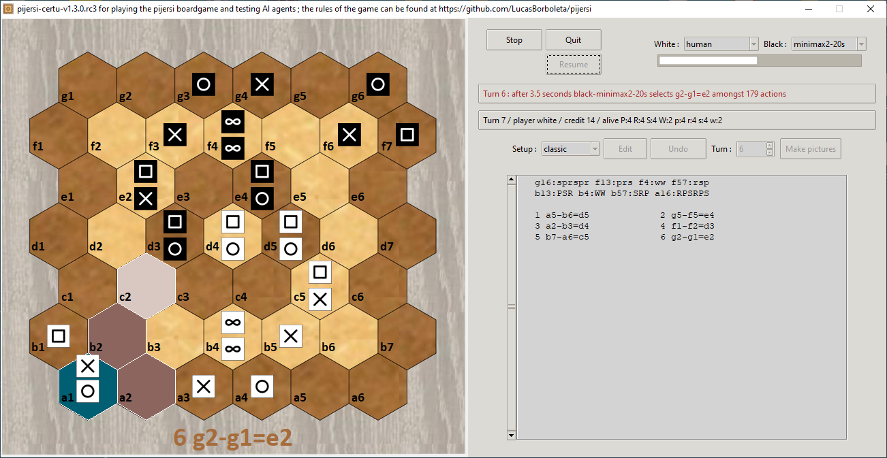

# Pijersi certu

The Python package *pijersi_certu* provides a GUI and a rules engine for playing the *Pijersi* board-game, which is a *wise men oriented* variant of [*Jersi*](https://github.com/LucasBorboleta/jersi) board-game. 

The rules of Pijersi are explained here [https://github.com/LucasBorboleta/pijersi](https://github.com/LucasBorboleta/pijersi) in a rulebook (Markdown and PDF formats) and also here in videos in  [English](https://youtu.be/w2c6-h2DAus) or in  [French](https://youtu.be/w41zrhBB5t8) (both with subtitles).

*pijersi_certu* is being developed on Windows and should be portable on Linux. For running it on your computer read the [**INSTALL**](./docs/INSTALL.md) instructions.

If you intent to derive or to sell either a text, a product or a software from this work, then read the [**LICENSE**](./docs/LICENSE.txt) and the  [**COPYRIGHT**](./docs/COPYRIGHT.md)  documents. Many thanks to the [**CONTRIBUTORS**](./docs/CONTRIBUTORS.md) of the *pijersi-certu* project !

Another Pijersi implementation is here in two parts:

- Engine and Minimax-AI (very powerful thanks to C++ ) :https://github.com/arthur-liu-lsh/pijersi-engine
- 3D GUI : https://github.com/arthur-liu-lsh/pijersi-unity
