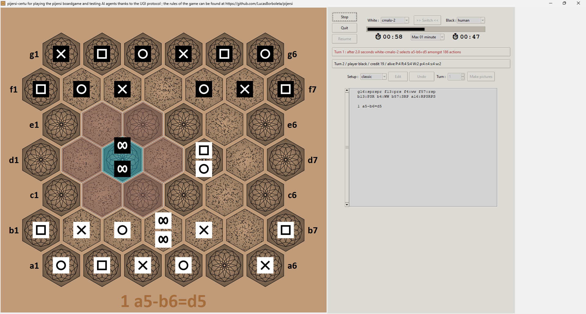

# Pijersi certu

The Python package *pijersi_certu* provides a GUI and a rules engine for playing the *Pijersi* board-game, which is a *wise men oriented* variant of [*Jersi*](https://github.com/LucasBorboleta/jersi) board-game. 

The rules of Pijersi are explained here [https://github.com/LucasBorboleta/pijersi](https://github.com/LucasBorboleta/pijersi) in a rulebook (Markdown and PDF formats) and also here in videos in  [English](https://youtu.be/w2c6-h2DAus) or in  [French](https://youtu.be/w41zrhBB5t8) (both with subtitles).

*pijersi_certu* is being developed on Windows and should be portable on Linux. For running it on your computer read the [**INSTALL**](./docs/INSTALL.md) instructions. 

The **[UGI protocol](https://github.com/eclypse-prime/pijersi-engine/blob/main/ugi.md)** allows *pijersi_certu* to embed other AI implemented in various languages like the **Natural Selection** AI coded in Rust. Therefore the own Python AI of *pijersi_certu* has been blessed **cmalo** (pronounced *sh-malo* = *small* in lojban).

If you intent to derive or to sell either a text, a product or a software from this work, then read the [**LICENSE**](./docs/LICENSE.txt) and the  [**COPYRIGHT**](./docs/COPYRIGHT.md)  documents. The **Natural Selection** AI-engine is copyright [Eclypse-Prime](mailto:eclypse.prime@gmail.com). 

Many thanks to the [**CONTRIBUTORS**](./docs/CONTRIBUTORS.md) of the *pijersi-certu* project !

A preliminary [comparative study](./docs/study-cmalo-natsel.md) of *cmalo* and *natsel* (*Natural Selection*) AI-engines at same minimax depth has been performed .

Another Pijersi implementations :

- Engines and Minimax-AI (called *Natural Selection* and shorten *natsel* in the *pijersi_certu* GUI)
  - https://github.com/eclypse-prime/pijersi-engine : very powerful engine implemented in C++ ;
  - https://github.com/eclypse-prime/pijersi-rs : very powerful engine implemented in Rust.
- 3D GUI : https://github.com/eclypse-prime/pijersi-unity

